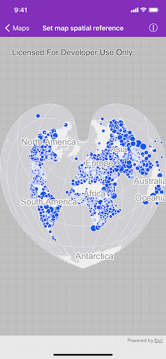

# Map spatial reference

Specify a map's spatial reference.

## Use case

Choosing the correct spatial reference is important for ensuring accurate projection of data points to a map.

## How to use the sample

Pan and zoom around the map. Observe how the map is displayed using the World Bonne spatial reference.

## How it works

1. Instantiate an `AGSMap` object using a spatial reference with `AGSMap.init(spatialReference:)`.
2. Instantiate an `AGSArcGISMapImageLayer` object and add it to the map's `operationalLayers` property.
3. Set the map to a `AGSMapView` object.

The ArcGIS map image layer will now use the spatial reference set to the ArcGIS map (World Bonne (WKID: 54024)) and not it's default spatial reference (WGS84 (WKID: 4326)).
 
## Relevant API

* AGSArcGISMapImageLayer
* AGSMap
* AGSMapView
* AGSSpatialReference

## Additional information

Operational layers will automatically project to this spatial reference when possible.

## Tags

project, SpatialReference, WKID
