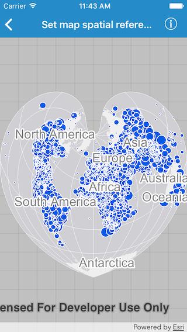

# Set map spatial reference

This sample demonstrates how you can set the spatial reference on a `AGSMap` and all the operational layers would project accordingly.

## How it works

The map in the sample app is initialized with `esriSRProjCS_World_Bonne (WKID: 54024)` spatial reference using `init(spatialReference:)` initializer. Hence the map image layer that is added, with default spatial reference as `GCS_WGS_1984 (WKID: 4326)`, gets re-projected to map's spatial reference.

