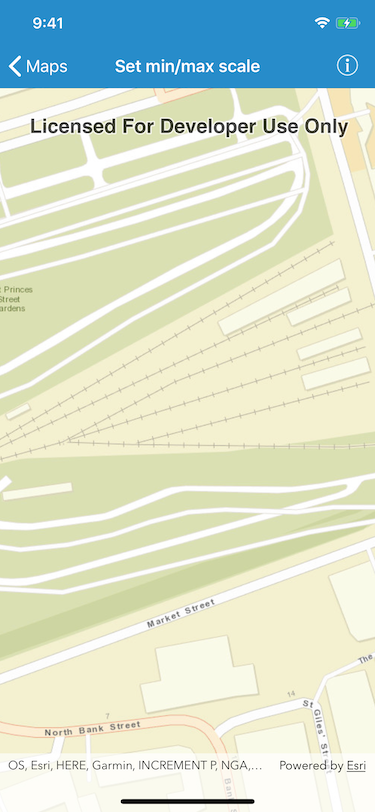

# Set min/max scale

This sample demonstrates how to set the minimum and maximum scale of a map.

## How to use the sample

Pinch to zoom in and out of the map. Notice that the scale of which you can do that is limited by the application.

## How it works

Set the minimum and maximum scale using the `minScale` and `maxScale` properties of `AGSMap`.

## Relevant API

 - `AGSMap.minScale`
 - `AGSMap.maxScale`

## Tags

Maps, 2D, scale, setMinScale, setMaxScale, zoom
