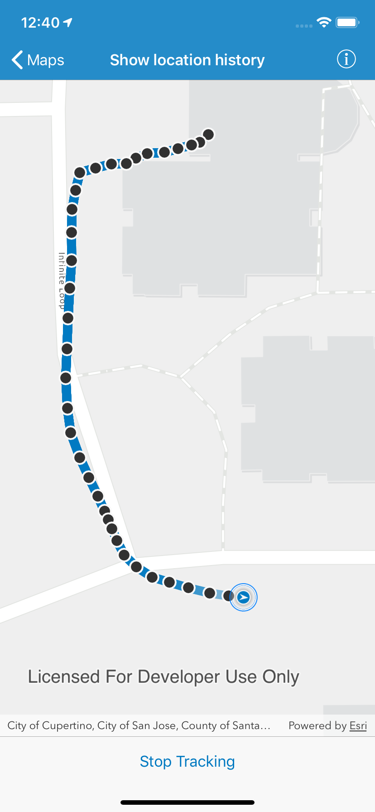

# Show location history

Display your location history on the map.

## Use case

You can track device location history and display it as lines and points on the map. The history can be used to visualize how the user moved through the world, to retrace their steps, or to create new feature geometry. An unmapped trail, for example, could be added to the map using this technique.

## How to use the sample

Tap 'Start tracking' to start tracking your location, which will appear as points on the map. A line will connect the points for easier visualization. Tap 'Stop tracking' to stop updating the location history.

## How it works

1. If necessary, request location permission from the operating system.
2. Create a graphics overlay to show each point and another graphics overlay for displaying the route line.
3. Create an instance of `AGSCLLocationDataSource`, and start receiving location updates.
4. Specify a `locationChangedHandler` on `AGSLocationDisplay` to handle location updates.
5. Every time the location updates, store that location, display a point on the map, and re-create the route line.

## Relevant API

- `AGSCLLocationDataSource`
- `AGSGraphic`
- `AGSGraphicsOverlay`
- `AGSLocationDataSource`
- `AGSLocationDisplay`
- `AGSMap`
- `AGSMapView`
- `AGSPolylineBuilder`
- `AGSSimpleLineSymbol`
- `AGSSimpleMarkerSymbol`
- `AGSSimpleRenderer`

## About the data

The sample uses a light gray vector basemap. The default data source relies on Core Location, which works with either device sensors or location simultation.

## Tags

GPS, bread crumb, breadcrumb, history, movement, navigation, real-time, trace, track, trail
