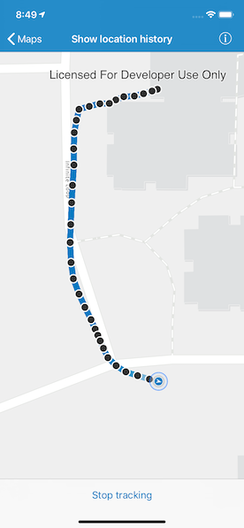

# Show location history
This sample shows you how to display your location history on the map.

## How to use the sample
Tap 'Start Tracking' to start tracking your location, which will evince points on the map corresponding to detected locations. A line will connect the points as they accumulate. Tap 'Stop Tracking' to stop updating the location history.

## How it works
The sample project consists of a storyboard (`LocationHistory.storyboard`), a view controller (`LocationHistoryViewController.swift`), and a rudimentary class to coordinate the actual location tracking (`LocationTracking.swift`).

- The view controller is fairly straightforward; it has a subview of type `AGSMapView`, and exposes a `UIBarButtonItem` to manage the tracking status of the sample.
- The majority of the logic is implemented in `LocationTracker`, which is initialized with the aforementioned map view and a reference to the location history view. A parameter of type `AGSLocationDataSource` can be injected if you would like to override the default data source, which is backed by Core Location (i.e., `AGSCLLocationDataSource`).
- Once the the map has been loaded, the `spatialReference` is obtained to instantiate a `AGSPolylineBuilder` (i.e., `trackBuilder`) that works in conjunction with an instance of type `AGSGraphicsOverlay` (i.e., `trackOverlay`) to compose a path based on location history. A separate overlay, `locationsOverlay` is used to present individual location updates.
