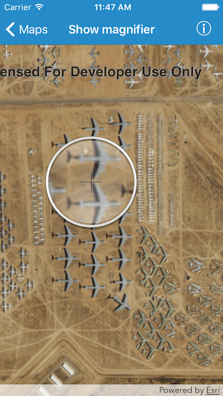

#Show magnifier

This sample demonstrates how you can tap and hold on a map to get the magnifier. You can also pan while tapping and holding to move the magnifier across the map.

##How it works

`AGSMapView` has a property called `interactionOptions` of type `AGSMapViewInteractionOptions` which in turn has `magnifierEnabled` that indicates whether a magnifier should be shown on the map when the user performs a tap and hold gesture. Its default value is `YES` or `true`. You can also use the `allowMagnifierToPan` property to indicate whether the map should be panned automatically when the magnifier gets near the edge of the map's bounds.

