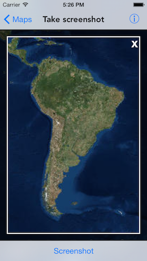

#Take screenshot

This sample demonstrates how you can take screenshot of a map.

##How to use the sample

The sample has a `Screenshot` button in the bottom toolbar you can tap to take screenshot of the visible area of the map. You can pan or zoom to a specific location and tap on the button, which also shows you the preview of the image produced. You can tap on the `X` button or any where on the preview image to close it.

##How it works

`AGSMapView` has a method called `exportImage(completion:)` that provides an image depicting the current map display.

