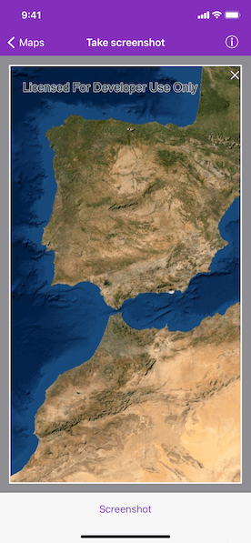

# Take screenshot

Take a screenshot of the map.

## Use case

GIS users may want to export a screenshot of a map to enable sharing as an image or printing.

## How to use the sample

Pan and zoom to find an interesting location, then tap the button to take a screenshot. The screenshot will be displayed. Note that there may be a small delay if the map is still rendering when you push the button.

## How it works

1. Wait for the map view to finish rendering the map.
2. Call `AGSMapView.exportImage(completion:)` method to get a `UIImage` object.

## Relevant API

* AGSGeoView.exportImage(completion:)
* AGSMapView

## Tags

capture, export, image, print, screen capture, screenshot, share, shot
