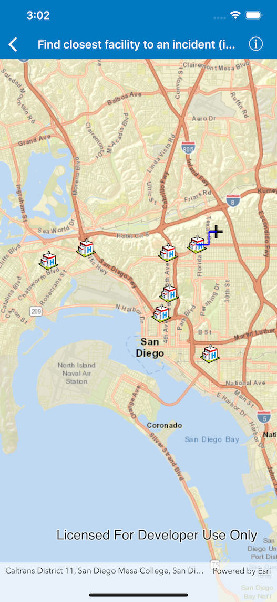

# Find closest facility to an incident (interactive)

Find a route to the closest facility from a location.

## Use case

Quickly and accurately determining the most efficient route between a location and a facility is a frequently encountered task. For example, a paramedic may need to know which hospital in the vicinity offers the possibility of getting an ambulance patient critical medical care in the shortest amount of time. Solving for the closest hospital to the ambulance's location using an impedance of "travel time" would provide this information.

## How to use the sample

Tap near any of the hospitals and a route will be displayed from that tapped location to the nearest hospital.

## How it works

1.  Create a new `AGSClosestFacilityTask` using a URL from an online network analysis service.
2.  Get `AGSClosestFacilityParameters` from the task.
3.  Add facilities to the parameters.
4.  Add an incident (as an `AGSPoint`) to the parameters.
5.  Get `AGSClosestFacilityResult` by solving the task with the parameters.
6.  Get the indexed list of closet facilities to the incident.
7.  Get the index of the closest facility.
8.  Get closest facility route from the facility result.
9.  Display the route on the `AGSMapView` as an `AGSGraphic` on an `AGSGraphicsOverlay`.

## Relevant API

*   AGSClosestFacilityParameters
*   AGSClosestFacilityResult
*   AGSClosestFacilityRoute
*   AGSClosestFacilityTask
*   AGSFacility
*   AGSGraphic
*   AGSGraphicsOverlay
*   AGSIncident

## Tags

routing & directions, incident, network analysis, route, search
