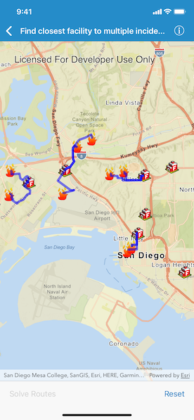

# Find closest facility to multiple incidents (service)

Find routes from several locations to the respective closest facility.

## Use case

Quickly and accurately determining the most efficient route between a location and a facility is a frequently encountered task. For example, a city's fire department may need to know which fire stations in the vicinity offer the quickest routes to multiple fires. Solving for the closest fire station to the fire's location using an impedance of "travel time" would provide this information.

## How to use the sample

Tap the Solve Routes button to solve and display the route from each incident (fire) to the nearest facility (fire station).

## How it works

1. Create an instance of `AGSClosestFacilityTask` using a URL to an online service.
2. Get the default set of closest facility parameters from the task.
3. Create separate arrays of all facilities and all incidents:
  * Create an instance of `AGSFeatureTable` with the URL of a feature layer.
  * Query the feature table for all features.
  * Iterate over the found features and add each to the array, instantiating the feature as an `AGSFacility` or an `AGSIncident`.
4. Add the array of all facilities to the task parameters.
5. Add the array of all incidents to the task parameters.
6. Get an `AGSClosestFacilityResult` by solving the task with the provided parameters.
7. Find the closest facility for each incident by iterating over the array of incidents.
8. Display the route as an `AGSGraphic`.

## Relevant API

*   AGSClosestFacilityParameters
*   AGSClosestFacilityResult
*   AGSClosestFacilityRoute
*   AGSClosestFacilityTask
*   AGSFacility
*   AGSGraphic
*   AGSGraphicsOverlay
*   AGSIncident

## Tags

incident, network analysis, route, search