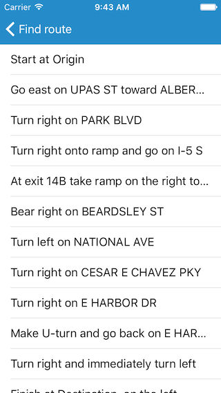

# Find route

Display directions for a route between two points.

## Use case

Find routes with driving directions between any number of locations. You might use the ArcGIS platform to create a custom network for routing on a private roads.

## How to use the sample

For simplicity, the sample comes loaded with a start and end stop. You can click on the Find Route button to display a route between these stops. Once the route is generated, tap the directions icon for turn-by-turn directions shown in a list.

## How it works

1. Create a `AGSRouteTask` using a URL to an online route service.
2. Generate default `AGSRouteParameters` using `_.getDefaultParameters`.
3. Set `_.returnDirections` on the parameters to true.
4. Add `AGSStop`s to the parameters `stops` collection for each destination.
5. Solve the route using `routeTask.solveRoute(with:completion:)` to get an `AGSRouteResult`.
6. Iterate through the result's `AGSRoute`s. To display the route, create a graphic using the geometry from `_routeGeometry`. To display directions, use `route.getDirectionManeuvers()`, and for each `DirectionManeuver`, display `_.directionManeuvers`.

## Relevant API

*   AGSDirectionManeuver
*   AGSRoute
*   AGSRouteParameters
*   AGSRouteResult
*   AGSRouteTask
*   AGSStop

## Tags

directions, driving, navigation, network, network analysis, route, routing, shortest path, turn-by-turn
