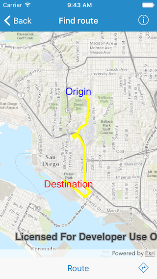

#Find route

This sample demonstrates how to get a route between two locations

##How to use the sample

For simplicity, the sample comes loaded with a start and end stop. You can tap on the route button to get a route between these stops. Once the route is generated, the directions button gets enabled. Tap on the button to see the step by step directions for the route.

##How it works

The sample uses the `defaultRouteParameters(completion:)` method on `AGSRouteTask` to get the default parameters from the service. Sets the stops in those parameters and the `returnDirections` to true. Then uses the `solveRoute(with:completion:)` method to solve for the route. Once the route is in, the sample displays the list of directions using the `directionManeuvers` property on the `AGSRoute` returned in the `AGSRouteResult`

