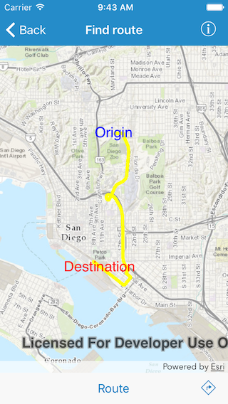

# Find route

This sample demonstrates how to get a route between two locations

## How to use the sample

For simplicity, the sample comes loaded with a start and end stop. You
can tap on the route button to get a route between these stops. Once the
route is generated, the directions button gets enabled. Tap on the
button to see the step by step directions for the route.

 

## How it works

The sample uses the `defaultRouteParameters(completion:)` method on
`AGSRouteTask` to get the default parameters from the service. Sets the
stops in those parameters and the `returnDirections` to true. Then uses
the `solveRoute(with:completion:)` method to solve for the route. Once
the route is in, the sample displays the list of directions using the
`directionManeuvers` property on the `AGSRoute` returned in the
`AGSRouteResult`
