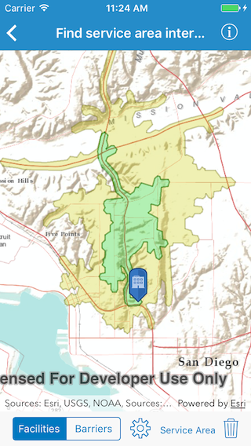

# Find service area interactive

Find the service area within a network from a given point.

## Use case

A service area shows locations that can be reached from a facility based off a certain impedance, such as travel time or distance. Barriers can increase impedance by either adding to the time it takes to pass through the barrier or by altogether preventing passage.

You might calculate the region around a hospital in which ambulances can service in 30 min or less.

## How to use the sample

In order to find any service areas at least one facility needs to be added to the map view.
* To add a facility, tap the facility button, then tap anywhere on the map.
* To add a barrier, tap the barrier button, and tap multiple locations on map. Tap the barrier button again to finish drawing barrier. Tapping any other button will also stop the barrier from drawing.
* To show service areas around facilities that were added, tap show service areas button. 
* The reset button clears all graphics and resets the service area task.

## How it works

1. Create a new `AGSServiceAreaTask` from a network service.
2. Create default `AGSServiceAreaParameters` from the service area task.
3. Set the `AGSPolygonBarrier` to `polygon`.
4. Add a `AGSServiceAreaFacility` to the parameters.
5. Get the `AGSServiceAreaResult` by solving the service area task using the parameters.
6. Get any `AGSServiceAreaPolygon`s that were returned by using _.resultPolygons(atFacilityIndex:).
7. Display the service area polygons as graphics in an `AGSGraphicsOverlay` on the `MapView`.

## Relevant API

* AGSPolygonBarrier
* AGSServiceAreaFacility
* AGSServiceAreaParameters
* AGSServiceAreaPolygon
* AGSServiceAreaResult
* AGSServiceAreaTask

## Tags

barriers, facilities, impedance, logistics, routing
