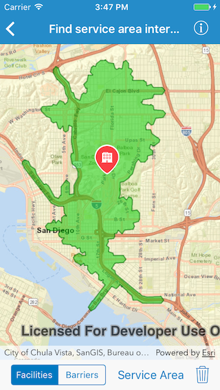

# Find service area interactive

This sample demonstrates how to find services areas around a point. A service area shows locations that can be reached from a facility based off a certain impedance [such as travel time]. Barriers can also be added which can affect the impedance by not letting traffic through or adding the time is takes to pass that barrier.

## How to use the sample

Use the segmented control in the toolbar to switch between `Facilities` and `Barriers`. To add a facility tap on a location on map and a marker will be added. For barrier, tap on the map to draw buffered polygon. Tap on the settings button item to change time breaks. Hit the `Service Area` button to get the service area for added facilities. Tap on the clear button to start over.

## How it works

The sample uses the `defaultRouteParameters(completion:)` method on `AGSServiceAreaTask` to get the default parameters from the service. Barriers are created using the initializer `init(polygon:)` on `AGSPolygonBarrier`. Sets the facilities and barriers in the parameters. Then uses the `solveServiceArea(with:completion:)` method to solve for the route. Once the result is in, the sample displays the service areas for individual facilities using `resultPolygons(atFacilityIndex:)` method on `AGSServiceAreaResult`.

