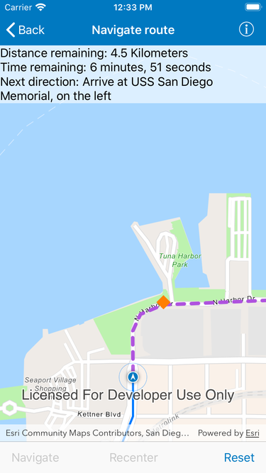

# Navigate route

Use a routing service to navigate between two points.

## Use case

Navigation is often used by field workers while traveling between two points to get live directions based on their location.

## How to use the sample

Tap "Navigate" to simulate traveling and to receive directions from a preset starting point to a preset destination. Tap "Reset" to start the simulation from the beginning.

## How it works

1. Create an `AGSRouteTask` using a URL to an online route service.
2. Generate default `AGSRouteParameters` using `AGSRouteTask.defaultRouteParameters(completion:)`.
3. Set `returnRoutes`, `returnStops` and `returnDirections` on the parameters to `true`.
4. Assign all `AGSStop` objects to the route parameters using `AGSRouteParameters.setStops(_:)`.
5. Solve the route using `AGSRouteTask.solveRoute(with:completion:)` to get an `AGSRouteResult`.
6. Create an `AGSRouteTracker` using the route result, and the index of the desired route to take.
7. Use `AGSLocationChangeHandlerDelegate.locationDataSource(_:locationDidChange:)` to track the location of the device and update the route tracking status.
8. Use `AGSRouteTrackerDelegate.routeTracker(_:didUpdate:)` to be notified of `AGSTrackingStatus` changes, and use them to display updated route information. `AGSTrackingStatus` includes a variety of information on the route progress, such as the remaining distance, remaining geometry or traversed geometry (represented by an `AGSPolyline`), or the remaining time (`Double`), amongst others.
9. Use `AGSRouteTrackerDelegate.routeTracker(_:didGenerateNewVoiceGuidance:)`  to be notified of new voice guidances. From the voice guidance, get the `AGSVoiceGuidance.text` representing the directions and use a text-to-speech engine to output the maneuver directions.
10. You can also query the tracking status for the current `AGSDirectionManeuver` index, retrieve that maneuver from the `AGSRoute` and get it's direction text to display in the GUI.
11. To establish whether the destination has been reached, get the `destinationStatus` from the tracking status. If the destination status is `.reached`, and the `remainingDestinationCount` is 1, we have arrived at the destination and can stop routing. If there are several destinations in your route, and the remaining destination count is greater than 1, switch the route tracker to the next destination.

## Relevant API

* AGSDestinationStatus
* AGSDirectionManeuver
* AGSLocation
* AGSLocationDataSource
* AGSRoute
* AGSRouteParameters
* AGSRouteTask
* AGSRouteTracker
* AGSSimulatedLocationDataSource
* AGSStop
* AGSVoiceGuidance

## Offline data

None

## About the data

The route taken in this sample goes from the San Diego Convention Center, site of the annual Esri User Conference, to the Fleet Science Center, San Diego.

## Tags

directions, maneuver, navigation, route, turn-by-turn, voice
