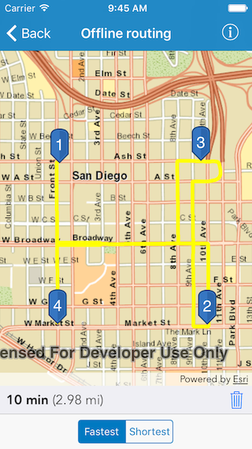
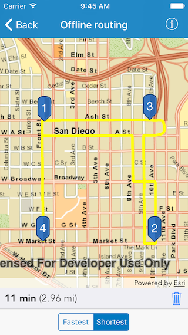

#Offline routing

This sample demonstrates how to route using a local San Diego streets network dataset loaded into the app.

##How to use the sample

You tap on the map to add a stop. As you add individual stops the sample solves the route between the stops. If you tap, hold and move then the route will be calculated dynamically; on the fly. You can also switch between the fastest or the shortest route.

##How it works

The sample uses the `defaultRouteParameters(completion:)` method on `AGSRouteTask` to get the default parameters from the service. In this sample the stop locations are set in the parameters. These are then used by the `solveRoute(with:completion:)` method to solve the route.

