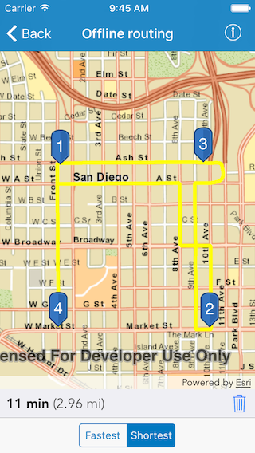

# Offline routing

Solve a route on-the-fly using offline data.

## Use case

You can use an offline network to enable routing in disconnected scenarios. For example, you could provide offline location capabilities to field workers repairing critical infrastructure in a disaster when network availability is limited.

## How to use the sample

Tap near a road to start adding a stop to the route, tap again to place it on the map. A number graphic will show its order in the route. After adding at least 2 stops, a route will display. Choose "Fastest" or "Shortest" to control how the route is optimized. The route will update on-the-fly while adding stops. 

## How it works

1. Create the map's `AGSBasemap` from a local tile package using an `AGSTileCache` and `AGSArcGISTiledLayer`.
2. Create an `AGSRouteTask` with an offline locator geodatabase.
3. Get the `AGSRouteParameters` using `_.getDefaultParameters()`.
4. Create `AGSStop`s and add them to the route task's parameters.
5. Solve the route using `AGSRouteTask.solveRoute(with:completion:)`.
6. Create a graphic with the route's geometry and a `AGSSimpleLineSymbol` and display it on another `AGSGraphicsOverlay`.

## Offline data

The data used by this sample is available on [ArcGIS Online](https://arcgisruntime.maps.arcgis.com/home/item.html?id=567e14f3420d40c5a206e5c0284cf8fc).

## About the data

This sample uses a pre-packaged sample dataset consisting of a geodatabase with a San Diego road network and a tile package with a streets basemap.

## Relevant API

* AGSRouteParameters
* AGSRouteResult
* AGSRouteTask
* AGSStop
* AGSTravelMode

## Tags

connectivity, disconnected, fastest, locator, navigation, network analysis, offline, routing, routing, shortest, turn-by-turn
