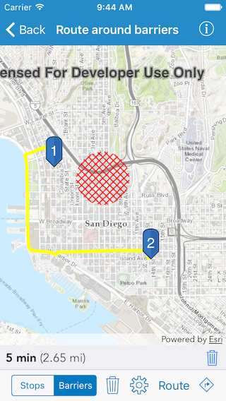
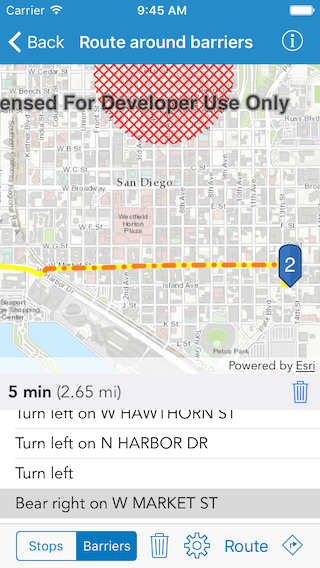

#Route around barriers

This sample demonstrates how to generate a route among multiple stops taking into account different barriers.

##How to use the sample

Select `Stops` from the switch in the toolbar. Tap on the map to add any number of stops. Then select `Barriers` and tap on the map to add buffered polygons as barriers. Tap on the settings button to pick among different routing options. Now tap on the `Route` button to generate a route connecting all the stops you added. Once the route is computed, you should see details about the route, like route length and the travel time. The directions list button should also be enabled. When you tap on the directions button you should see a list of directions. You can select each direction to highlight it on the map. If you want to delete a route tap on the trash icon next to the route details. And if you want to delete either stops or barriers, select the right one on the switch and tap on the trash icon in the toolbar.

##How it works

The sample uses the `defaultRouteParameters(completion:)` method on `AGSRouteTask` to get the default parameters from the service. Barriers are created using the initializer `init(polygon:)` on `AGSPolygonBarrier`. Sets the stops and barriers in those parameters and the `returnDirections` to true. Then uses the `solveRoute(with:completion:)` method to solve for the route. Once the route is in, the sample displays the list of directions using the `directionManeuvers` property on the `AGSRoute` returned in the `AGSRouteResult`.

