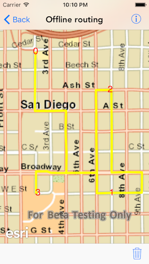

#Offline routing

This sample demonstrates how to route using network data loaded in the app

##How to use the sample

You can either tap or tap and hold to add a stop to the map view. The sample starts solving for routes as you add more stops. You can also tap hold and move for on the fly routing.

##How it works

The sample uses the `generateDefaultParametersWithCompletion:` method on `AGSRouteTask` to get the default parameters from the service. Sets the stops in those parameters. Then uses the `solveRouteWithParameters:completion:` method to solve for the route.

