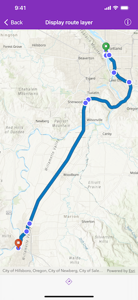

# Display route layer

Display a route layer uisng feature collection.

## Use case

The map is the fundamental building block of any GIS application and is used to specify how geographic data is organized and communicated to your users.

## How to use the sample

Pan and zoom to view the route displayed by the feature collection layer.

## How it works

1. Create an `AGSMap` object with an `AGSBasemapStyle.arcGISImageryStandard` basemap style.
2. Create an `AGSMapView` object to display the map.
3. Set the map to the map view.

## Relevant API

* AGSBasemapStyle
* AGSMap
* AGSMapView

## Tags

basemap style, map
