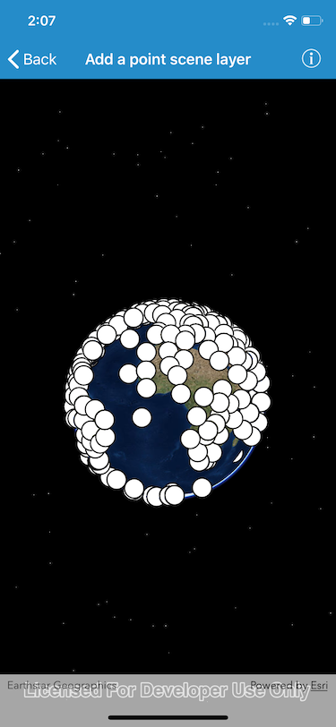

# Add a point scene layer

View a point scene layer from a scene service

## Use case

Point scene layers can efficiently display large amounts of point features. While point cloud layers can only display simple symbols, point scene layers can display any type of billboard symbol or even 3D models, as long as the location of the symbol can be described by a point. Points are cached and automatically thinned when zoomed out to improve performance.

## How it works

1. Create a scene.
2. Create an `AGSArcGISSceneLayer` object with the URL to an point scene layer service.
3. Add the layer to the scene's operational layers collection.

## Relevant API

- `AGSArcGISSceneLayer`

## About the data

This dataset contains more than 40,000 points representing world airports. Points are retrieved on demand by the scene layer as the user navigates the scene.

## Additional information

Point scene layers can also be retrieved from scene layer packages (.slpk) and mobile scene packages (.mspk).

## Tags

3D, point scene layer, layers