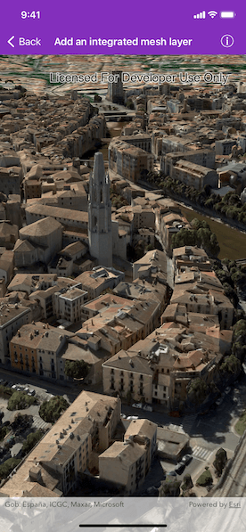

# Add an integrated mesh layer

View an integrated mesh layer from a scene service.

## Use case

An integrated mesh is used to generate a mesh over a point dataset. They are most often used on high-density point datasets to create a high-resolution seamless surface.

## How to use the sample

After launching the sample, watch the integrated mesh layer load in place of the extruded imagery basemap. Navigate around the scene to visualize the high level of detail on the cliffs and valley floor.

## How it works

1. Create an `AGSScene`.
2. Create an `AGSIntegratedMeshLayer` object with the URL to an integrated mesh layer scene service.
3. Add the layer to the scene's operational layers collection.
4. Create a `AGSCamera` object and set it as the viewpoint camera of the scene view.

## Relevant API

* AGSIntegratedMeshLayer

## About the data

This data is derived from  point cloud data from a lidar survey. Lidar data is often of a high enough resolution to capture 3D features as small as walls and trees, but also the irregular surfaces of geological features like cliffs. An integrated mesh made from a point cloud of lidar data will include realistic textures and elevation information.

This integrated mesh depicts Little Yosemite Valley in California's Yosemite National Park, including the 3,000ft granite face of El Capitan.

## Additional information

An integrated mesh layer can also be added to a scene from a local data source - either from a scene layer package (.slpk) or a mobile scene package (.mspk).

## Tags

3D, integrated mesh, layers
