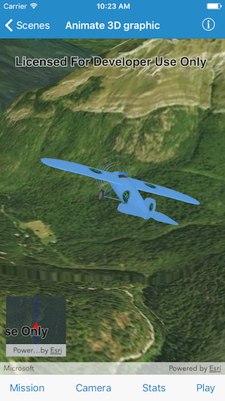

# Animate 3D graphic

This sample demonstrates how to animate a graphic’s position and rotation and have the camera follow it.

# How to use the sample

The sample comes loaded with mission files containing frame by frame data about graphic’s location, heading, pitch and offset. You can pick between different mission files using the horizontal scroller in `Mission Settings`. Tap on the `Play` button to start or pause the animation. You can change the speed of animation. The progress of the mission is also shown. Under `Camera Settings` you can changes the distance between the graphic and the camera. You can change the `headingOffset` or the `pitchOffset` of the camera with respect to the graphic. Under `Plane Stats` you can see the current altitude, heading, pitch or roll of the graphic. 

## How it works

A model symbol for the plane is created using `init(name:extension:scale:)` initializer. A graphic for the plane is created using this symbol and added to graphics overlay. A simple renderer `AGSSimpleRenderer` is created and expressions for heading, pitch and roll are specified on the renderer. These expressions will help rotate the plane graphic based on the values assigned in the `attributes` property of the graphic. The renderer is then applied on the graphics overlay. An `AGSOrbitGeoElementCameraController` object is initialized with the plane graphic and distance to maintain between the camera and the graphic, using `init(targetGeoElement:distance:)` initializer. The camera controller is then assigned to the scene view. When the `Play` button is clicked, a `Timer` is created to animate the position and rotation of the plane graphic based on the values in the mission files. The sliders under `Camera Settings` update the corresponding properties on the camera controller.
