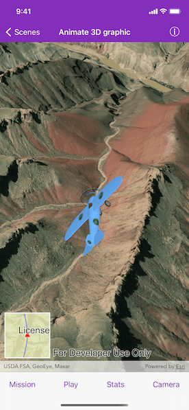

# Animate 3D graphic

An `AGSOrbitGeoElementCameraController` follows a graphic while the graphic's position and rotation are animated.

## Use case

Visualize movement through a 3D landscape.

## How to use the sample

Tap the bottom buttons to adjust settings for the animation:
* Mission: change the flight path, speed, and view progress
* Play/Pause: toggle the animation
* Stats: view the attributes of the animation
* Camera: change the camera distance, heading, pitch, and other camera properties.

## How it works

1. Create an `AGSGraphicsOverlay` and add it to the `AGSSceneView`.
2. Create an `AGSModelSceneSymbol` object.
3. Create an `AGSGraphic` object and set its geometry to an `AGSPoint`.
4. Set the `AGSModelSceneSymbol` object to the graphic.
5. Add heading, pitch, and roll attributes to the graphic. 
6. Create an `AGSSimpleRenderer` object and set its expression properties.
7. Add graphic and a renderer to the graphics overlay.
8. Create an `AGSOrbitGeoElementCameraController` which is set to target the graphic.
9. Assign the camera controller to the `AGSSceneView`.
10. Update the graphic's location, heading, pitch, and roll.

## Relevant API

* AGSScene
* AGSCamera
* AGSGlobeCameraController
* AGSGraphic
* AGSGraphicsOverlay
* AGSModelSceneSymbol
* AGSOrbitGeoElementCameraController
* AGSRenderer
* AGSSceneView
* AGSSurfacePlacement

## Offline data

This sample uses the following data which are all downloaded from ArcGIS Online automatically: 
* [Model Marker Symbol Data](https://www.arcgis.com/home/item.html?id=681d6f7694644709a7c830ec57a2d72b)
* [GrandCanyon.csv mission data](https://www.arcgis.com/home/item.html?id=290f0c571c394461a8b58b6775d0bd63)
* [Hawaii.csv mission data](https://www.arcgis.com/home/item.html?id=e87c154fb9c2487f999143df5b08e9b1)
* [Pyrenees.csv mission data](https://www.arcgis.com/home/item.html?id=5a9b60cee9ba41e79640a06bcdf8084d)
* [Snowdon.csv mission data](https://www.arcgis.com/home/item.html?id=12509ffdc684437f8f2656b0129d2c13)

## Tags

animation, camera, heading, pitch, roll, rotation, visualize
