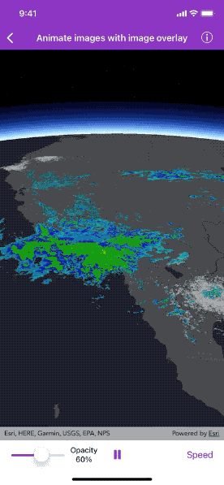

# Animate images with image overlay

Animate a series of images with an image overlay.

## Use case

An image overlay is useful for displaying fast and dynamic images; for example, rendering real-time sensor data captured from a drone. Each frame from the drone becomes a static image which is updated on the fly as the data is made available.

## How to use the sample

The sample loads a map of the Southwestern United States. Tap the play or pause buttons to start or pause the radar animation. Select a playback speed to decide how quickly the animation plays. Move the slider to change the opacity of the image overlay.

## How it works

1. Create an `AGSImageOverlay` and add it to the `AGSSceneView`.
2. Set up a repeating timer with an initial interval time of 16ms, which will display approximately 60 `AGSImageFrame`s per second.
3. Create a new image frame when the timer fires and set it on the image overlay.

## Relevant API

* AGSImageFrame
* AGSImageOverlay
* AGSSceneView

## About the data

These radar images were captured by the US National Weather Service (NWS). They highlight the Pacific Southwest sector which is made up of part the western United States and Mexico. For more information visit the [National Weather Service](https://www.weather.gov/jetstream/gis) website. The archive for radar images can be downloaded from [ArcGIS Online](https://runtime.maps.arcgis.com/home/item.html?id=d1453556d91e46dea191c20c398b82cd).

## Additional information

The supported image formats are GeoTIFF, TIFF, JPEG, and PNG. `AGSImageOverlay` does not support the rich processing and rendering capabilities of an `AGSRasterLayer`. Use `AGSRaster` and `AGSRasterLayer` for static image rendering, analysis, and persistence.

## Tags

3D, animation, drone, dynamic, image frame, image overlay, real time, rendering
