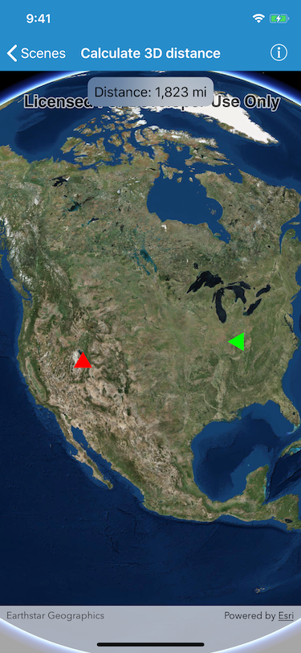

# Calculate Distance 3d

Calculate the 3D distance between two graphics.

## How to use the sample

Once the scene view has loaded, the graphics' animation will begin. The distance between the two graphics will be displayed at the top of the application and will be updated when the animation starts.

## How it works

To calculate the distance between two graphics in 3D space:

1. Create an `AGSGraphicsOverlay` object and attach it to the scene view.
2. Create two `AGSGraphic` objects and add them to the graphics overlay.
  - Supply each graphic with a location and symbol.
3. Convert each graphic's point to the Cartesian coordinate system.
4. Create an `simd_double3` instance from the Cartesian x, y, and z values.
5. Get the distance between each of the points using `simd_distance(_:_:)`.

## Relevant API

- `AGSScene`
- `AGSGraphic`
- `AGSGraphicsOverlay`
- `AGSSceneView`
