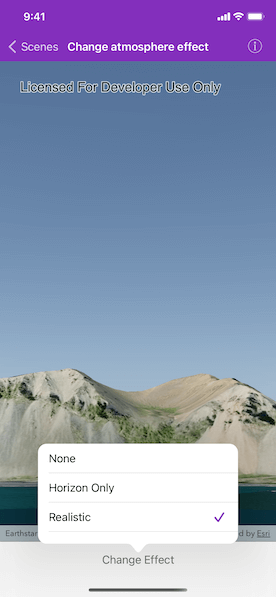

# Change atmosphere effect

Change the appearance of the atmosphere in a scene.

## Use case

Atmospheric effect can be used to make the scene view look more realistic.

## How to use the sample

Tap "Change Effect" and select one of the three available atmosphere effects. The sky will change to display the selected atmosphere effect.

## How it works

1. Create an `AGSScene` and display it in an `AGSSceneView`.
2. Change the scene view's `atmosphereEffect` property to the desired atmosphere effect.

## Relevant API

* AGSAtmosphereEffect
* AGSScene
* AGSSceneView

## Additional information

There are three atmosphere effect options:

* **Realistic** - A realistic atmosphere effect is applied over the entire surface.
* **Horizon only** - Atmosphere effect applied to the sky (horizon) only.
* **None** - No atmosphere effect. The sky is rendered black with a starfield consisting of randomly placed white dots.

## Tags

atmosphere, horizon, sky
