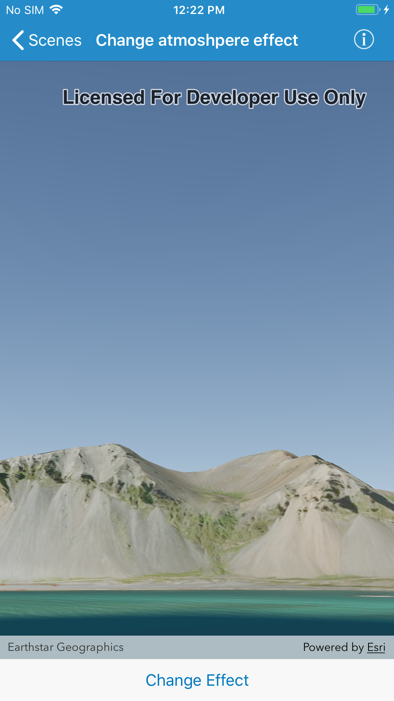

# Change atmosphere effect

Changes the appearance of the atmosphere in a scene.

## How to use the sample

Select one of the three available atmosphere effects. The sky will change to display the selected atmosphere effect. 

## How it works

To change the atmosphere effect:

1. Create an `AGSScene` and display it in a `AGSSceneView`.
2. Change the atmosphere effect by setting the `atmosphereEffect` property of the scene view with the desired `AGSAtmosphereEffect`.
 
## Relevant API
- `AGSScene`
- `AGSSurface`
- `AGSArcGISTiledElevationSource`
- `AGSCamera`
- `AGSSceneView`
- `AGSAtmosphereEffect`

## Additional Information

There are three atmosphere effect options:

- **None**: No atmosphere effect. The sky is rendered black with a starfield consisting of randomly placed white dots.
- **Horizon only**: Atmosphere effect applied to the sky (horizon) only.
- **Realistic**: Atmosphere effect applied to both the sky and the surface as viewed from above. 

## Tags

3D, Atmosphere Effect, Scene 