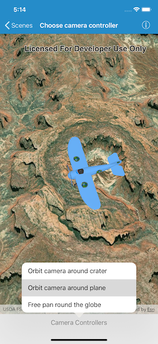

# Choose camera controller

Control the behavior of the camera in a scene.

## Use case

The globe camera controller (the default camera controller in all new scenes) allows a user to explore the scene freely by zooming in/out and panning around the globe. The orbit camera controllers fix the camera to look at a target location or geoelement. A primary use case is for following moving objects like cars and planes.

## How to use the sample

The application loads with the default globe camera controller. To rotate and fix the scene around the plane, exit globe mode by choosing the "Orbit camera around plane" option (i.e. camera will now be fixed to the plane). Choose the "Orbit camera around crater" option to rotate and center the scene around the location of the Upheaval Dome crater structure, or choose the "Free pan round the globe" option to return to default free navigation.

## How it works

1.  Create an instance of a class extending `AGSCameraController`: `AGSGlobeCameraController`, `AGSOrbitLocationCameraController`, `AGSOrbitGeoElementCameraController`.
2.  Set the `cameraController` property of `AGSSceneView`.

## Relevant API

*   `AGSScene`
*   `AGSCamera`
*   `AGSGlobeCameraController`
*   `AGSOrbitGeoElementCameraController`
*   `AGSOrbitLocationCameraController`
*   `AGSSceneView`

## Tags

Camera Controller, Camera, SceneView, 3D
