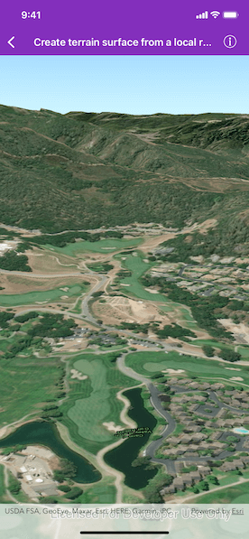

# Create terrain from a local raster

Set the terrain surface with elevation described by a raster file.

## Use case

The terrain surface is what the basemap, operational layers, and graphics are draped on. Supported raster formats include:

* ASRP/USRP
* CIB1, 5, 10
* DTED0, 1, 2
* GeoTIFF
* HFA
* HRE
* IMG
* JPEG
* JPEG 2000
* NITF
* PNG
* RPF
* SRTM1, 2

## How to use the sample

When launched, this sample displays a scene that was rendered using a local raster file. Pan and zoom to explore the scene.

## How it works

1. Create an `AGSScene` and add it to a `AGSSceneView`.
2. Create a `AGSRasterElevationSource` with an array of raster file URLs.
3. Add this source to the scene's base surface.

## Relevant API

* AGSRasterElevationSource
* AGSSurface

## About the data

This raster data comes from Monterey, California.

## Offline data

This sample uses the [MontereyElevation](https://arcgisruntime.maps.arcgis.com/home/item.html?id=98092369c4ae4d549bbbd45dba993ebc) raster. It is downloaded from ArcGIS Online automatically.

## Tags

3D, raster, elevation, surface
