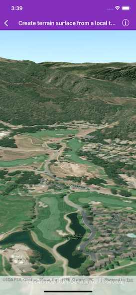

# Create terrain from a local tile package

Set the terrain surface with elevation described by a local tile package.

## Use Case

The terrain surface is what the basemap, operational layers, and graphics are draped on. The tile package must be a LERC (limited error raster compression) encoded TPK. Details on creating these are in the [ArcGIS Pro documentation](https://pro.arcgis.com/en/pro-app/help/sharing/overview/tile-package.htm).

Terrain can be loaded offline from tile packages (.tpk).

## How it works

1. Create an `AGScene` and add it to a `AGSSceneView`.
2. Create an `AGSArcGISTiledElevationSource` with the path to the local tile package.
3. Add this source to the scene's base surface.

## Relevant API

* AGSArcGISTiledElevationSource
* AGSSurface

## About the data

This terrain data comes from Monterey, California.

## Offline data

This sample uses the [Monterey Elevation](https://arcgisruntime.maps.arcgis.com/home/item.html?id=cce37043eb0440c7a5c109cf8aad5500) tile package. It is downloaded from ArcGIS Online automatically.

## Tags

3D, tile cache, elevation, surface
