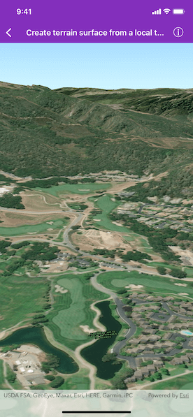

# Create terrain from a local tile package

Set the terrain surface with elevation described by a local tile package.



## Use Case

The terrain surface is what the basemap, operational layers, and graphics are draped on. The tile package must be a LERC (limited error raster compression) encoded TPK. Details on creating these are in the [ArcGIS Pro documentation](https://pro.arcgis.com/en/pro-app/help/sharing/overview/tile-package.htm).

Terrain can be loaded offline from tile packages (.tpk).

## How it works

1. Create an `ASScene` and add it to a `SceneView`.
2. Create an `AGSArcGISTiledElevationSource` with the path to the local tile package.
3. Add this source to the scene's base surface: ```
surface.elevationSources.append(elevationSource)
scene.baseSurface = surface```.

## Relevant API

* AGSArcGISTiledElevationSource
* Surface

## About the data

This terrain data comes from Monterey, California.

## Offline data

1. Download the data from [ArcGIS Online](https://arcgisruntime.maps.arcgis.com/home/item.html?id=cce37043eb0440c7a5c109cf8aad5500).
2. Extract the contents of the downloaded zip file to disk.
3. Add the contents to argis-ios-sdk-samples/Portal Data/Tile Packages.
4. Under "On Demand Resource Tags" in the File Inspector, assign a tag to this file.
5. Add the tag to the list of dependencies in ContentPList.plist.

<table>
    <tr>
        <th> Link </th>
        <th>Local Location</th>
    </tr>
    <tr>
        <td><a href="https://www.arcgis.com/home/item.html?id=cce37043eb0440c7a5c109cf8aad5500">MontereyElevation Tile Package</a></td>
        <td><xmp><userhome>/ArcGIS/Runtime/Data/tpk/MontereyElevation.tpk </xmp></td>
    </tr>
</table>

## Tags
3D, tile cache, elevation, surface
