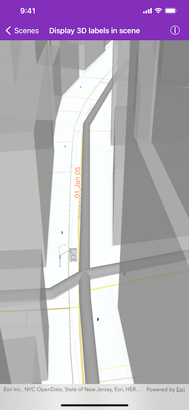

# Display 3D labels in scene

Display custom labels in a 3D scene.

## Use case

Labeling features is useful to visually display information or attributes on a scene. For example, city officials or maintenence crews may want to show installation dates on a gas network.

## How to use the sample

Pan and zoom to explore the scene. Notice the labels on the 3D gas network.

## How it works

1. Create an `AGSScene` using a URL .
2. Apply the scene to an `AGSSceneView` and load it.
3. After loading is complete, obtain the `AGSFeatureLayer` from the scene's `operationalLayers`.
4. Set the feature layer's `labelsEnabled` property to `true`.
5. Create an `AGSTextSymbol` to use for displaying the label text.
6. Create a JSON string for the label definition.
    * Set the "labelExpressionInfo.expression" key to express what the text the label should display. You can use fields of the feature by using `$feature.NAME` in the expression.
    * To use the text symbol, set the "symbol" key to the symbol's JSON representation using `AGSTextSymbol.toJSON()`.
7. Create a label definition from the JSON using `AGSJSONSerializable.fromJSON(_:)`.
8. Add the definition to the feature layer's `labelDefinitions` array.

## Relevant API

* AGSFeatureLayer
* AGSLabelDefinition
* AGSScene
* AGSSceneView
* AGSTextSymbol

## About the data

This sample shows a [NYC infrastructure scene](https://www.arcgis.com/home/item.html?id=850dfee7d30f4d9da0ebca34a533c169) hosted on ArcGIS Online.

## Tags

3D, attribute, buildings, label, model, scene, symbol, text, URL, visualization
