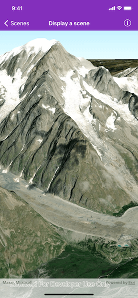

# Display a scene

Display a scene with a terrain surface and some imagery.

## Use case

Scene views are 3D representations of real-world areas and objects. Scene views are helpful for visualizing complex datasets where 3D relationships, topography, and elevation of elements are important factors.

## How to use the sample

When loaded, the sample will display a scene. Pan and zoom to explore the scene.

## How it works

1. Create an `AGSSceneView` object to display the map.
2. Create an `AGSScene` object with the `.imagery()` basemap.
3. Set the scene to the scene view.
4. Create an `AGSArcGISTiledElevationSource` object using a URL and add it to the scene's base surface.

## Relevant API

* AGScene
* AGSArcGISTiledElevationSource
* AGSSceneView

## Tags

3D, basemap, elevation, scene, surface
