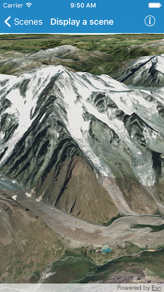

#Display a scene

This sample demonstrates how to display an scene with elevation data.

##How it works

The sample initializes an `AGSScene` with an `AGSBasemap`. It then assigns this scene to an `AGSSceneView`. For the elevation, it creates an `AGSSurface` and adds an `AGSArcGISTiledElevationSource` as an elevation source to the surface. The surface is then set as the `baseSurface` on the scene.