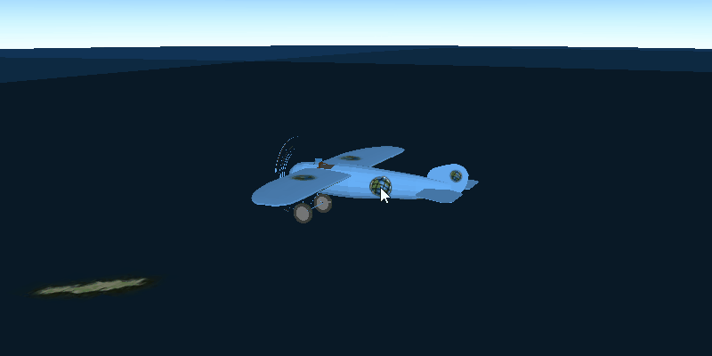

# Distance composite symbol

Demonstrates how to create a graphic using a distance composite scene symbol. Distance composite scene symbols can render different symbols depending on the distance between the camera and the graphic.

# How to use the sample

The symbol of graphic will change while zooming in or out.

## How it works

<ol>
  <li>Create an <code>AGSGraphicsOverlay</code> and add it to the <code>AGSSceneView</code>.</li>
  <li>Create symbols for each <code>AGSRange</code> the composite symbol.</li>
  <li>Create a distance composite scene symbol.</li>
  <li>Add a range for each symbol to <code>distanceCompositeSceneSymbol.ranges.append(AGSDistanceSymbolRange(symbol:minDistance:maxDistance:))</code>.
    <ul><li>symbol, symbol to be used within the min/max range that is given</li>
      <li>min/max distance, the minimum and maximum distance that the symbol will be displayed from the <code>AGSCamera</code></li></ul></li>
  <li>Create a <code>AGSGraphic</code> with the symbol: <code>AGSGraphic(geometry:symbol:attributes:)</code></li>
  <li>Add the graphic to the graphics overlay.</li>
</ol>
