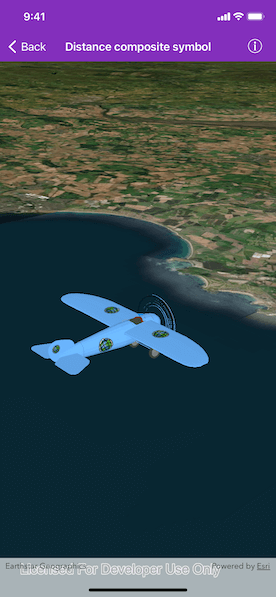

# Distance composite symbol

Change a graphic's symbol based on the camera's proximity to it.

## Use case

When showing dense datasets, it is beneficial to reduce the detail of individual points when zooming out to avoid visual clutter and to avoid data points overlapping and obscuring each other.

## How to use the sample

The sample starts looking at a plane. Zoom out from the plane to see it turn into a cone. Keeping zooming out and it will turn into a point.

## How it works

1. Create an `AGSGraphicsOverlay` object and add it to an `AGSSceneView` object.
2. Create an `AGSDistanceCompositeSceneSymbol` object.
3. Create `AGSDistanceSymbolRange` objects specifying an `AGSSymbol` and the min and max distance within which the symbol should be visible.
4. Add the ranges to the range collection of the distance composite scene symbol.
5. Create an `AGSGraphic` object with the distance composite scene symbol at a location and add it to the graphics overlay.

## Relevant API

* AGSDistanceCompositeSceneSymbol
* AGSDistanceSymbolRange
* AGSOrbitGeoElementCameraController

## Tags

3D, data, graphic
