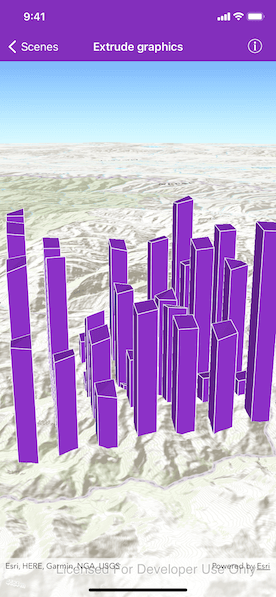

# Extrude Graphics

Extrude graphics based on an attribute value.

## Use case

Graphics representing features can be vertically extruded to represent properties of the data that might otherwise go unseen. Extrusion can add visual prominence to data beyond what may be offered by varying the color, size, or shape of symbol alone. For example, graphics representing wind turbines in a wind farm application can be extruded by a real-world "height" attribute so that they can be visualized in a landscape. Likewise, census data can be extruded by a thematic "population" attribute to visually convey population levels across a country.

## How to use the sample

Once the sample is launched, notice that the graphics are extruded to the level set in their height property. Pan and zoom to explore

## How it works

1. Create an `AGSScene` with a `topographic()` basemap.
2. Set the scene to an `AGSSceneView`.
2. Create an `AGSGraphicsOverlay` and `AGSSimpleRenderer`.
3. Set the renderer's `extrusionMode` property to `baseHeight`.
4. Specify the attribute name of the graphic that the extrusion mode will use by setting the renderer's `extrusionExpression` property to `[height]`.
5. Apply the renderer to the graphics overlay.
6. Create graphics and specify the attributes with the key `height`.

## Relevant API

* AGSExtrusionMode
* AGSRendererSceneProperties
* AGSScene
* AGSSimpleRenderer

## About the data

This sample uses [World Elevation data](https://elevation3d.arcgis.com/arcgis/rest/services/WorldElevation3D/Terrain3D/ImageServer) from ArcGIS REST Services.

## Tags

3D, extrude, extrusion, height, scene, visualization
