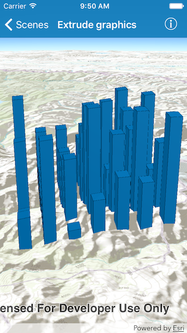

# Extrude Graphics

This sample demonstrates how to render graphics extruded in the z direction.

## How it works

The sample uses the `sceneProperties` on the `AGSSimpleRenderer` assigned to `AGSGraphicsOverlay` to enable extrusion of the graphics.
