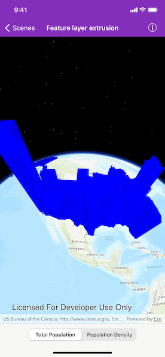

# Feature layer extrusion

Extrude features based on their attributes.

## Use case

Extrusion is the process of stretching a flat, 2D shape vertically to create a 3D object in a scene. For example, you can extrude building polygons by a height value to create three-dimensional building shapes.

## How to use the sample

Tap the bottom buttons to switch between using population density and total population for extrusion. Higher extrusion directly corresponds to higher attribute values.

## How it works

1. Create an `AGSServiceFeatureTable` from a URL.
2. Create an `AGSFeatureLayer` from the service feature table.
* Make sure to set the `renderingMode` property to `.dynamic`.
3. Apply an `AGSSimpleRenderer` to the feature layer.
4. Set the renderer's `extrusionMode` property to `.absoluteHeight`.
5. Set the renderer's `extrusionExpression` property to `"[POP2007]/ 10"`.

## Relevant API

* AGSExtrusionMode
* AGSFeatureLayer
* AGSRendererSceneProperties
* AGSServiceFeatureTable
* AGSSimpleRenderer

## Tags

3D, extrude, extrusion, extrusion expression, height, renderer, scene
