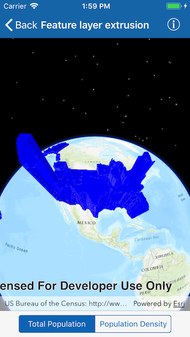

# Feature layer extrusion

This sample demonstrates how to apply extrusion to a renderer on a feature layer.

## How it works
To extrude features from an `AGSFeatureLayer`:

1. Create an `AGSServiceFeatureTable` from an URL.
2. Create a feature layer from service feature table.
Make sure to set rendering mode to dynamic, `layer.renderingMode = .dynamic`.
3. Apply a SimpleRenderer to the feature layer.
4. Set `ExtrusionMode` of render, `renderer.sceneProperties.extrusionMode = .baseHeight`.
5. Set extrusion expression of renderer, `renderer.sceneProperties.extrusionExpression = "[POP2007]/ 10"`.

## Features
- FeatureLayer
- SceneProperties
- ServiceFeatureTable
- FeatureLayer
