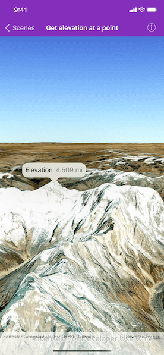

# Get elevation at a point

Get the elevation for a given point on a surface in a scene.

## Use case

Knowing the elevation at a given point in a landscape can aid in navigation, planning and survey in the field.

## How to use the sample

Tap anywhere on the surface to get the elevation at that point. Elevation is reported in the standard local measurements since the scene view is in WGS84.

## How it works

1. Create a scene view and scene with an imagery base map.
2. Set the elevation source of the scene's base surface.
3. Convert the tapped screen point into a point on surface.
4. Asynchronously get the elevation and display the results.

## Relevant API

* AGSArcGISTiledElevationSource
* AGSElevationSource
* AGSSceneView
* AGSSurface

#### Tags

elevation, point, surface
