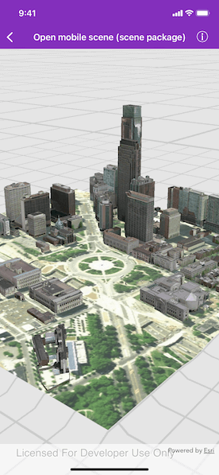

# Open mobile scene (scene package)

Opens and displays a scene from a mobile scene package (.mspk).

## Use case

An .mspk file is an archive containing the data (specifically, basemaps and features), used to display an offline 3D scene.

## How to use the sample

When the sample opens, it will automatically display the Scene in the Mobile Map Package.

## How it works

This sample takes a Mobile Scene Package that was created in ArcGIS Pro, and displays an `AGSScene` from within the package in an `AGSSceneView`.

1. Create an `AGSMobileScenePackage` object using the path to the local .mspk file.
2. Load the mobile scene package with`AGSMobileScenePackage.load(completion:)` and check for any errors.
3. When the `AGSMobileScenePackage` instance is loaded, obtain the first `AGSScene` object from the `AGSMobileScenePackage.scenes` property.
4. Assign the scene to the scene view.

## Relevant API

* AGSMobileScenePackage
* AGSSceneView

## About the data

This mobile scene package was authored with ArcGIS Pro. It is downloaded from ArcGIS Online automatically.

[This item is available on ArcGIS Online](https://www.arcgis.com/home/item.html?id=7dd2f97bb007466ea939160d0de96a9d)

## Tags

offline, scene
