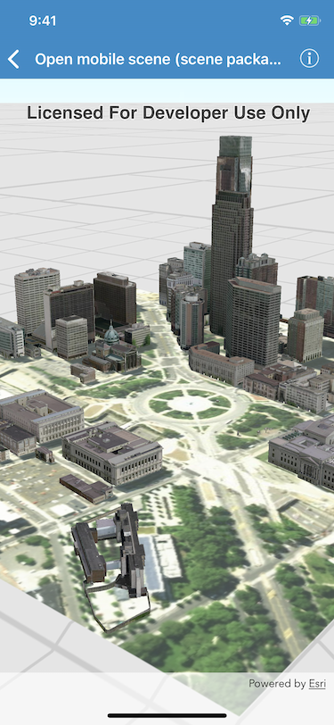

# Open mobile scene (scene package)

Opens and displays a scene from a Mobile Scene Package (.mspk).

An .mspk file is an archive containing the data (specifically, basemaps and features), used to display an offline 3D scene.
A mobile scene package can also be unpacked to a directory to allow read support for certain data types.

## How to use the sample

When the sample opens, it will automatically display the Scene in the Mobile Map Package.

## How it works

This sample takes a Mobile Scene Package that was created in ArcGIS Pro, and displays an `AGSScene` from within the package in an `AGSSceneView`. 

1. Create an `AGSMobileScenePackage` object using the path to the local .mspk file.
2. Use `class AGSMobileScenePackage.checkDirectReadSupportForMobileScenePackage(atFileURL:completion:)` to check whether the package can be read in the archived form (.mspk) or whether it needs to be unpacked.
3. If the mobile scene package requires unpacking, call `class AGSMobileScenePackage.unpack(atFileURL:outputDirectory:completion:)` and wait for this to complete.
3. Call `AGSMobileScenePackage.load(completion:)` and check for any errors.
4. When the `AGSMobileScenePackage` instance is loaded, obtain the first `AGSScene` object from the `AGSMobileScenePackage.scenes` property.
5. Assign the scene to the scene view.

## Relevant API

- `AGSMobileScenePackage`
- `AGSSceneView`

## About the data

This mobile scene package was authored with ArcGIS Pro. The package will be downloaded from ArcGIS Online automatically when needed at build time.
	
- [Item on ArcGIS Online](https://www.arcgis.com/home/item.html?id=7dd2f97bb007466ea939160d0de96a9d)

## Tags

Offline, Scene
