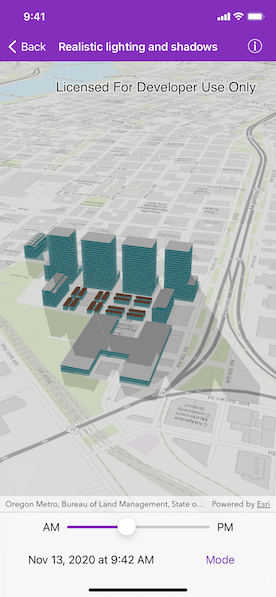

# Realistic lighting and shadows

Show realistic lighting and shadows for a given time of day.

## Use case

You can use realistic lighting to evaluate the shadow impact of buildings and utility infrastructure on the surrounding community. This could be useful for civil engineers and urban planners, or for events management assessing the impact of building shadows during an outdoor event.

## How to use the sample

Select one of the three lighting options to show that lighting effect on the `AGSSceneView`. Select a time of day from the slider (based on a 24hr clock) to show the lighting for that time of day in the `AGSSceneView`.

## How it works

1. Create an `AGSScene` and display it in an `AGSSceneView`.
2. Create a `Calendar` to define the time of day.
3. Set the sun time to the scene view's `sunTime` property.
4. Set the `sunLighting` property of the scene view to `noLight`, `light`, or `lightAndShadows`.

## Relevant API

* AGSLightingMode
* AGSScene
* AGSSceneView

## Tags

3D, lighting, realism, realistic, rendering, shadows, sun, time
