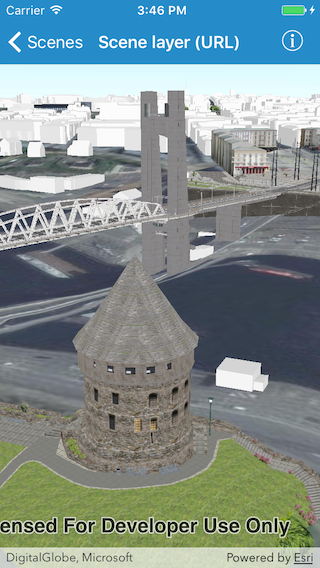

# Scene layer (URL)

The sample shows how to use a scene layer in a scene.

## How it works

The sample initializes an `AGSArcGISSceneLayer` object using the `init(url:)` initializer. It then adds the scene layer to the scene’s `operationalLayers` using the `add(_:)` method.
