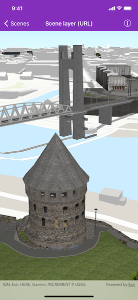

# Scene layer (URL)

Display an ArcGIS scene layer from a URL.

## Use case

Adding a scene layer from a URL allows you to author the scene layer elsewhere in the platform, say with ArcGIS Pro or CityEngine, and then add that scene layer to a scene in Runtime. Loading a scene layer from a URL also permits the layer source to change dynamically without updating the code.

## How to use the sample

Pan and zoom to explore the scene.

## How it works

1. Create an `AGSScene` with an `.imagery()` basemap.
2. Apply the scene to an `AGSSceneView`.
3. Create an `AGSArcGISTiledElevationSource` with a URL and add it to an `AGSSurface. 
4. Apply the surface to the scene.
5. Create an `AGSArcGISSceneLayer` with a URL and add it to the scene's `operationalLayers` array.

## About the data

This sample shows a [Brest, France Scene](https://tiles.arcgis.com/tiles/P3ePLMYs2RVChkJx/arcgis/rest/services/Buildings_Brest/SceneServer/layers/0) hosted on ArcGIS Online.

## Relevant API

* AGSArcGISSceneLayer
* AGSScene
* AGSSceneView

## Tags

3D, buildings, model, Portland, scene, service, URL
