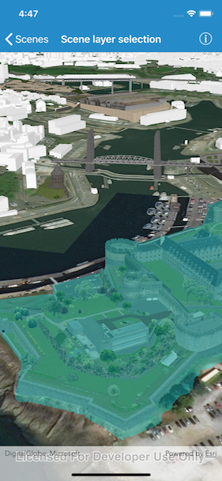

# Scene Layer Selection

This sample demonstrates how to identify geoelements in a scene layer.

## How to use the sample

Tap on a building in the scene layer to select it. Unselect buildings by
tapping away from the buildings.

## How it works

1.  Create an `AGSArcGISSceneLayer` passing in the URL to a scene layer
    service.
2.  Use `sceneView.touchDelegate` to get the screen tap location
    `screenPoint`.
3.  Call
    `sceneView.identifyLayer(_:screenPoint:tolerance:returnPopupsOnly:completion:)`
    to identify features in the scene.
4.  From the resulting `AGSIdentifyLayerResult`, get the list of
    identified `AGSGeoElement`s with `result.geoElements`.
5.  Get the first element in the list, checking that it is a feature,
    and call `sceneLayer.select(feature)` to select it.
