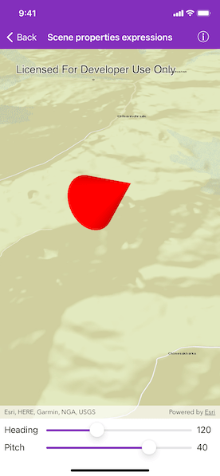

# Scene properties expressions

Update the orientation of a graphic using expressions based on its attributes.

## Use case

Instead of reading the attribute and changing the rotation on the symbol for a single graphic (a manual CPU operation), you can bind the rotation to an expression that applies to the whole overlay (an automatic GPU operation). This usually results in a noticeable performance boost (smooth rotations).

## How to use the sample

Adjust the heading and pitch sliders to rotate the cone.

## How it works

1. Create an `AGSGraphicsOverlay`.
2. Create an `AGSSimpleRenderer` and set its `sceneProperties`.
3. Set `headingExpression` to `[HEADING]` and `pitchExpression` to `[PITCH]`.
4. Apply the renderer to the graphics overlay.
5. Create an `AGSGraphic` and add it to the overlay.
6. To update the graphic's rotation, update the `HEADING` or `PITCH` property in the graphic's attributes.

## Relevant API

* AGSGraphicsOverlay
* AGSSceneProperties
* AGSSimpleRenderer

## Tags

3D, expression, graphics, heading, pitch, rotation, scene, symbology
